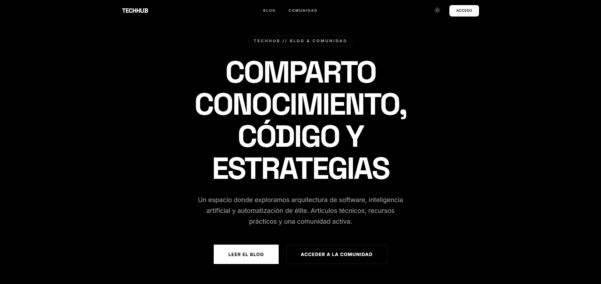
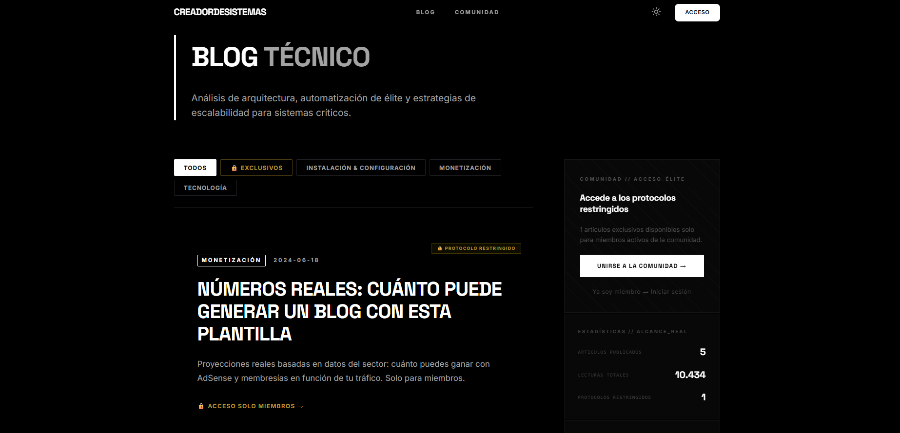
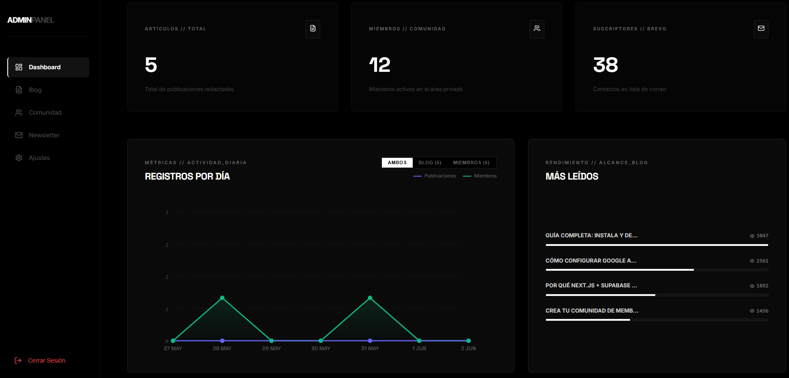

<div align="center">

# 🚀 Plantilla Blog Monetizable

**La plantilla más completa para lanzar tu blog personal, monetizarlo con Google AdSense y gestionarlo con un panel de administración.**

Built with Next.js · TypeScript · Supabase · Vercel

[](https://github.com/creadordesistemas/plantilla-blog-monetizable/actions/workflows/ci.yml)
[](https://opensource.org/licenses/MIT)
[](https://nextjs.org/)
[](https://www.typescriptlang.org/)
[](https://supabase.com/)
[](https://vercel.com/new/clone?repository-url=https%3A%2F%2Fgithub.com%2Fcreadordesistemas%2Fplantilla-blog-monetizable&env=NEXT_PUBLIC_SUPABASE_URL,NEXT_PUBLIC_SUPABASE_ANON_KEY,SUPABASE_SERVICE_ROLE_KEY,ADMIN_USER,ADMIN_PASSWORD,JWT_SECRET,NEXT_PUBLIC_SITE_URL&envDescription=Variables%20necesarias%20para%20el%20proyecto&envLink=https%3A%2F%2Fgithub.com%2Fcreadordesistemas%2Fplantilla-blog-monetizable%2Fblob%2Fmain%2F.env.example&project-name=mi-blog-monetizable&repository-name=mi-blog-monetizable)

---

[](https://vercel.com/new/clone?repository-url=https%3A%2F%2Fgithub.com%2Fcreadordesistemas%2Fplantilla-blog-monetizable&env=NEXT_PUBLIC_SUPABASE_URL,NEXT_PUBLIC_SUPABASE_ANON_KEY,SUPABASE_SERVICE_ROLE_KEY,ADMIN_USER,ADMIN_PASSWORD,JWT_SECRET,NEXT_PUBLIC_SITE_URL&envDescription=Variables%20necesarias%20para%20el%20proyecto&envLink=https%3A%2F%2Fgithub.com%2Fcreadordesistemas%2Fplantilla-blog-monetizable%2Fblob%2Fmain%2F.env.example&project-name=mi-blog-monetizable&repository-name=mi-blog-monetizable)

**🌐 Demo en Vivo → [Ver Demo en Vercel](https://plantilla-blog-monetizable-demo.vercel.app)** · **📋 Variables para la demo → [.env.demo.example](./.env.demo.example)**

> **¿La demo no carga?** Configura un proyecto en Vercel apuntando a la rama `demo` y añade las variables de [.env.demo.example](./.env.demo.example). No necesitas Supabase — los datos son de ejemplo en memoria.

</div>

---

## ✨ ¿Qué incluye esta plantilla?

| Característica | Descripción |
|---|---|
| 🏠 **Landing Page** | Hero animado, sección "Sobre mí", FAQ, Newsletter |
| 📝 **Blog** | Artículos desde Supabase con markdown completo |
| 👥 **Comunidad** | Acceso privado para miembros con suscripción |
| 🔐 **Panel Admin** | Dashboard completo protegido con JWT |
| 💰 **Google AdSense** | Preconfigurado (cabecera y pie de página) |
| 🌙 **Dark/Light Mode** | Transiciones suaves entre modos |
| 🔍 **SEO Técnico** | Sitemap, robots.txt, metadatos, JSON-LD |
| ⚖️ **Legal** | Políticas de privacidad, cookies y términos |
| ⚡ **100% Vercel** | Desplegable gratis en minutos |

---

## 🖼️ Screenshots

<div align="center">

### 🏠 Home — Hero principal


### 📝 Blog — Listado de artículos


### ⚙️ Panel de Administración


</div>

---

## 🚀 Deploy en un click

La forma más rápida de lanzar tu blog:

[](https://vercel.com/new/clone?repository-url=https%3A%2F%2Fgithub.com%2Fcreadordesistemas%2Fplantilla-blog-monetizable&env=NEXT_PUBLIC_SUPABASE_URL,NEXT_PUBLIC_SUPABASE_ANON_KEY,SUPABASE_SERVICE_ROLE_KEY,ADMIN_USER,ADMIN_PASSWORD,JWT_SECRET,NEXT_PUBLIC_SITE_URL&envDescription=Variables%20necesarias%20para%20el%20proyecto&envLink=https%3A%2F%2Fgithub.com%2Fcreadordesistemas%2Fplantilla-blog-monetizable%2Fblob%2Fmain%2F.env.example&project-name=mi-blog-monetizable&repository-name=mi-blog-monetizable)

1. Haz click en el botón de arriba
2. Conecta tu cuenta de GitHub
3. Rellena las variables de entorno (guía abajo)
4. ¡Deploy! 🎉

---

## 🛠️ Instalación local

### Requisitos previos

- [Node.js 18+](https://nodejs.org/)
- [Git](https://git-scm.com/)
- Cuenta en [Vercel](https://vercel.com/) (gratis)
- Cuenta en [Supabase](https://supabase.com/) (gratis)

```bash
# 1. Clona el repositorio
git clone https://github.com/creadordesistemas/plantilla-blog-monetizable.git
cd plantilla-blog-monetizable

# 2. Instala las dependencias
npm install

# 3. Copia el archivo de variables de entorno
cp .env.example .env.local

# 4. Edita .env.local con tus credenciales (ver guía abajo)

# 5. Inicia el servidor de desarrollo
npm run dev
```

Abre [http://localhost:3000](http://localhost:3000) en tu navegador. ¡Listo! 🎉

---

## 📋 Tabla de Contenidos

1. [Personalización Básica](#-personalización-básica)
2. [Configuración de Google AdSense](#-configuración-de-google-adsense)
3. [Despliegue en Vercel](#-despliegue-en-vercel)
4. [Configuración de la Base de Datos (Supabase)](#-configuración-de-la-base-de-datos-supabase)
5. [Estructura del Proyecto](#-estructura-del-proyecto)
6. [Curso de Personalización Guiado](#-curso-de-personalización-guiado)
7. [Seguridad](#-seguridad)
8. [Roadmap](#-roadmap)
9. [Contribuir](#-contribuir)
10. [Preguntas Frecuentes](#-preguntas-frecuentes)
11. [Demo Local](./docs/demo-local.md)


---

## 🎨 Personalización Básica

### 1. Datos del sitio (`data/settings.json`)

```json
{
  "siteName": "El nombre de tu blog",
  "contactEmail": "tu@correo.com",
  "supportEmail": "soporte@tudominio.com",
  "instagram": "https://instagram.com/tu_usuario",
  "tiktok": "https://tiktok.com/@tu_usuario",
  "youtube": "https://youtube.com/c/tu_canal",
  "linkedin": "https://linkedin.com/in/tu_usuario",
  "logo": "",
  "favicon": "/favicon.ico",
  "primaryColor": "#000000",
  "secondaryColor": "#ffffff",
  "domain": "tudominio.com"
}
```

### 2. Hero y presentación (`components/Hero.tsx`)

Busca el texto entre las comillas y personalízalo:

- **Tag superior:** `MI BLOG PERSONAL // DESARROLLO Y TECNOLOGÍA`
- **Título principal:** `COMPARTO CONOCIMIENTO, CÓDIGO Y ESTRATEGIAS`
- **Párrafo descriptivo:** El texto que aparece debajo del título

### 3. Sección "Sobre mí" (`components/AboutMe.tsx`)

Busca los comentarios `{/* 👇 PERSONALIZAR: */}` y reemplaza los placeholders:

- `[Tu Nombre]` → Tu nombre real
- `[Tu Título Profesional]` → Ej: "Desarrollador Full-Stack y Creador de Contenido"
- `[Tu frase filosófica aquí]` → Tu frase o filosofía personal

### 4. Logo en Navbar y Footer

En `components/Navbar.tsx` (línea ~182) y `components/Footer.tsx` (línea ~62):

```tsx
// Cambia "MI" y "BLOG" por las partes de tu marca:
TECH<span style={{ color: 'var(--foreground-secondary)' }}>HUB</span>
```

### 5. Favicon e imágenes

Reemplaza los archivos en la carpeta `/public/`:

- `favicon.ico` / `app/icon.svg` / `app/apple-icon.svg` → Tu favicon
- `og-image.png` → Imagen para redes sociales (1200×630px)

### 🎨 Guía de Marca completa

1. **Nombre del sitio**: Edita `"siteName"` en `data/settings.json` o desde el Panel Admin → Ajustes
2. **Favicon e Iconos**: Reemplaza `app/icon.svg` y `app/apple-icon.svg`
3. **Logotipo**: Reemplaza `public/logo.png`
4. **Open Graph**: Reemplaza `public/og-image.png` y `public/images/og-default.png`

---

## 🎓 Curso de Personalización Guiado

> **¿Cómo funciona?** Sigue estos 5 módulos en orden. Cada paso tiene instrucciones exactas — qué archivo editar, qué cambiar, cómo verificar que está bien. Al terminar tendrás el blog que ves en las capturas de pantalla (o el tuyo propio).

> **Demo local primero:** Antes de empezar, si deseas probar la demo localmente, sigue las instrucciones en la [guía de demo](./docs/demo-local.md) (clonando la rama `demo`) para ver el resultado.

---

<details>
<summary><strong>🎨 Módulo 1 — Identidad Visual</strong> &nbsp;·&nbsp; <em>Resultado: Tu marca en cada página</em></summary>

### Paso 1 · Nombre y datos del sitio

**Archivo:** `data/settings.json`

Edita estos campos:
```json
{
  "siteName": "El Nombre de Tu Blog",
  "contactEmail": "tu@email.com",
  "domain": "tudominio.com"
}
```

✅ **Verificar:** El título de la pestaña del navegador muestra tu nombre.

---

### Paso 2 · Logo en Navbar y Footer

**Archivo:** `components/Navbar.tsx` (busca `MI<span`) y `components/Footer.tsx`

Cambia las letras del logotipo:
```tsx
// Antes:
MI<span style={{ color: 'var(--foreground-secondary)' }}>BLOG</span>

// Después (ejemplo):
TECH<span style={{ color: 'var(--foreground-secondary)' }}>HUB</span>
```

✅ **Verificar:** El logo de la navbar muestra tu marca.

---

### Paso 3 · Texto del Hero

**Archivo:** `components/Hero.tsx`

Busca los comentarios `{/* ✏️ PERSONALIZAR */}` y edita:
- **Tag superior:** `MI BLOG PERSONAL // DESARROLLO Y TECNOLOGÍA`
- **Titular principal:** El `<h1>` grande
- **Párrafo descriptivo:** El texto debajo del titular

✅ **Verificar:** La portada del blog muestra tu mensaje.

---

### Paso 4 · Sección "Sobre mí"

**Archivo:** `components/AboutMe.tsx`

Sustituye los placeholders:
- `[Tu Nombre]` → tu nombre real
- `[Tu Título Profesional]` → ej: "Desarrollador Full-Stack"
- `[Tu frase filosófica aquí]` → tu frase personal

✅ **Verificar:** La sección "Sobre mí" en la home muestra tu información.

---

### Paso 5 · Favicon y logo

**Archivos a reemplazar:**
- `public/logo.png` → tu logo (PNG transparente)
- `app/icon.svg` → tu favicon SVG
- `public/og-image.png` → imagen para redes sociales (1200×630px)

✅ **Verificar:** La pestaña del navegador muestra tu icono.

</details>

---

<details>
<summary><strong>📝 Módulo 2 — Tu Primer Contenido</strong> &nbsp;·&nbsp; <em>Resultado: Blog activo con artículos reales</em></summary>

### Paso 1 · Accede al panel de administración

1. Ve a `http://localhost:3000/admin`
2. Usuario y contraseña: los que configuraste en `.env.local` (`ADMIN_USER` / `ADMIN_PASSWORD`)
3. En modo demo: `admin` / `admin`

✅ **Verificar:** Ves el dashboard con estadísticas.

---

### Paso 2 · Crea tu primer artículo

1. En el panel Admin → **Blog** → **Nuevo artículo**
2. Rellena: título, extracto, contenido (soporta Markdown completo), categoría
3. Añade una imagen de portada (URL o sube desde Supabase Storage)
4. Estado: **Publicado**
5. Guarda

✅ **Verificar:** El artículo aparece en `/blog` y en la home.

---

### Paso 3 · Crea un artículo exclusivo para miembros

1. Crea un nuevo artículo
2. Activa la opción **"Exclusivo para miembros"**
3. Publica

✅ **Verificar:** El artículo muestra un candado 🔒 en el blog y requiere login para leerlo.

---

### Paso 4 · Personaliza las FAQs

**Archivo:** `components/FAQ.tsx`

Edita el array `faqs` con tus propias preguntas y respuestas reales sobre tu blog.

✅ **Verificar:** La sección FAQ de la home muestra tus preguntas.

---

### Paso 5 · Publica al menos 3 artículos

Google necesita ver contenido consistente. Mínimo 3 artículos para que el blog tenga credibilidad:
- 1 artículo de presentación (¿quién eres y de qué va el blog?)
- 1 artículo con valor práctico para tu nicho
- 1 artículo exclusivo para miembros

✅ **Verificar:** La grid de artículos en la home muestra 3 cards.

</details>

---

<details>
<summary><strong>👥 Módulo 3 — Comunidad y Membresía</strong> &nbsp;·&nbsp; <em>Resultado: Área privada lista para vender</em></summary>

### Paso 1 · Define el precio de tu membresía

**Ruta:** Admin → **Ajustes de Comunidad**

Cambia el campo `priceMonthly` con tu precio mensual en euros.

✅ **Verificar:** La página `/comunidad` muestra el precio correcto.

---

### Paso 2 · Conecta Stripe

1. Crea una cuenta en [stripe.com](https://stripe.com)
2. Ve a **Products** → **Add product** → configura el precio recurrente mensual
3. En **Payment links** → crea un link de pago
4. Pega el link en Admin → Ajustes de Comunidad → **Stripe Link**

✅ **Verificar:** El botón "UNIRME A LA COMUNIDAD" redirige a Stripe.

---

### Paso 3 · Sube un recurso premium

**Ruta:** Admin → **Recursos** → **Nuevo recurso**

Sube un recurso de alto valor (PDF, plantilla, guía) que justifique la membresía.

✅ **Verificar:** Los miembros ven el recurso descargable en su área privada.

---

### Paso 4 · Crea un miembro de prueba

**Ruta:** Admin → **Miembros** → **Nuevo miembro**

Crea una cuenta de prueba con tu email y comprueba la experiencia completa:
1. El email de bienvenida con el link de configuración de contraseña
2. El acceso al área privada `/comunidad/privado`
3. La descarga de recursos

✅ **Verificar:** Puedes acceder a `/comunidad/privado` como miembro.

</details>

---

<details>
<summary><strong>💰 Módulo 4 — Monetización con AdSense</strong> &nbsp;·&nbsp; <em>Resultado: Anuncios activos y generando ingresos</em></summary>

### Paso 1 · Crea tu cuenta en Google AdSense

1. Ve a [google.com/adsense](https://www.google.com/adsense/)
2. Registra tu sitio con tu dominio real (no localhost)
3. Espera la aprobación de Google (puede tardar días o semanas)

---

### Paso 2 · Obtén tu Publisher ID y Slot IDs

1. En AdSense → **Anuncios** → **Por unidad de anuncio**
2. Crea 2 unidades de tipo "Pantalla adaptable":
   - `SLOT_CABECERA` (para la parte superior del blog)
   - `SLOT_PIE` (para el pie de los artículos)
3. Anota cada **Slot ID** (formato: `1234567890`)
4. Anota tu **Publisher ID** (formato: `ca-pub-XXXXXXXXXXXXXXXX`)

---

### Paso 3 · Configura las variables de entorno

En `.env.local` (local) y en Vercel → Settings → Environment Variables:

```env
NEXT_PUBLIC_ADSENSE_CLIENT_ID=ca-pub-XXXXXXXXXXXXXXXX
NEXT_PUBLIC_ADSENSE_TOP_SLOT=1234567890
NEXT_PUBLIC_ADSENSE_BOTTOM_SLOT=0987654321
```

✅ **Verificar:** Los componentes `<AdSenseUnit>` en el blog cargan sin errores de consola.

---

### Paso 4 · Verifica tu `ads.txt`

**Archivo:** `public/ads.txt`

Reemplaza el contenido con:
```
google.com, pub-XXXXXXXXXXXXXXXX, DIRECT, f08c47fec0942fa0
```

✅ **Verificar:** `https://tudominio.com/ads.txt` muestra la línea correcta.

</details>

---

<details>
<summary><strong>📢 Módulo 5 — Visibilidad y SEO</strong> &nbsp;·&nbsp; <em>Resultado: Google te encuentra y las redes te comparten</em></summary>

### Paso 1 · Redes sociales en el footer

**Archivo:** `data/settings.json`

Rellena tus perfiles reales:
```json
{
  "instagram": "https://instagram.com/tu_usuario",
  "tiktok": "https://tiktok.com/@tu_usuario",
  "youtube": "https://youtube.com/c/tu_canal",
  "linkedin": "https://linkedin.com/in/tu_usuario"
}
```

✅ **Verificar:** El footer muestra los iconos de redes con tus links.

---

### Paso 2 · Imagen de redes sociales (Open Graph)

1. Crea una imagen de 1200×630px con el nombre y logo de tu blog
2. Reemplaza `public/og-image.png` y `public/images/og-default.png`

✅ **Verificar:** Al pegar tu URL en Twitter/LinkedIn/WhatsApp aparece tu preview.

---

### Paso 3 · Registra tu sitio en Google Search Console

1. Ve a [search.google.com/search-console](https://search.google.com/search-console)
2. Añade tu dominio y verifica la propiedad
3. Envía tu sitemap: `https://tudominio.com/sitemap.xml`

✅ **Verificar:** Search Console muestra el sitemap procesado con tus URLs.

---

### Paso 4 · Configura el Newsletter con Brevo

1. Crea una cuenta gratuita en [brevo.com](https://www.brevo.com/)
2. Crea una lista de contactos y anota su ID
3. Ve a **Account** → **API Keys** y genera una clave
4. En Admin → **Newsletter** pega tu API Key y el ID de lista
5. Activa el newsletter

✅ **Verificar:** El formulario de newsletter en la home suscribe correctamente.

---

### Paso 5 · Envía tu primer boletín

Desde el panel Admin → **Newsletter** → redacta y envía tu primer email a tus suscriptores.

✅ **Verificar:** El email llega correctamente (revisa spam también).

</details>

---

## 💰 Configuración de Google AdSense

### Paso 1: Obtener tu Publisher ID

1. Ve a [Google AdSense](https://www.google.com/adsense/) y crea una cuenta
2. Tu **Publisher ID** tiene el formato `ca-pub-XXXXXXXXXXXXXXXX`

### Paso 2: Crear slots de anuncios

1. En AdSense → **Anuncios → Por unidad de anuncio**
2. Crea un anuncio de tipo "Pantalla adaptable"
3. Copia el **Slot ID** (ej: `1234567890`)
4. Repite para crear un segundo slot (cabecera y pie)

### Paso 3: Variables de entorno

```env
NEXT_PUBLIC_ADSENSE_CLIENT_ID=ca-pub-XXXXXXXXXXXXXXXX
NEXT_PUBLIC_ADSENSE_TOP_SLOT=1234567890
NEXT_PUBLIC_ADSENSE_BOTTOM_SLOT=0987654321
```

### Paso 4: Verificar `ads.txt`

```
google.com, pub-XXXXXXXXXXXXXXXX, DIRECT, f08c47fec0942fa0
```

> **Nota:** Los anuncios aparecerán una vez que Google apruebe tu sitio.

---

## ☁️ Despliegue en Vercel

### Método 1: Deploy en un click ⚡ (recomendado)

[](https://vercel.com/new/clone?repository-url=https%3A%2F%2Fgithub.com%2Fcreadordesistemas%2Fplantilla-blog-monetizable&env=NEXT_PUBLIC_SUPABASE_URL,NEXT_PUBLIC_SUPABASE_ANON_KEY,SUPABASE_SERVICE_ROLE_KEY,ADMIN_USER,ADMIN_PASSWORD,JWT_SECRET,NEXT_PUBLIC_SITE_URL&envDescription=Variables%20necesarias%20para%20el%20proyecto&envLink=https%3A%2F%2Fgithub.com%2Fcreadordesistemas%2Fplantilla-blog-monetizable%2Fblob%2Fmain%2F.env.example&project-name=mi-blog-monetizable&repository-name=mi-blog-monetizable)

### Método 2: Importar desde GitHub

1. **Sube tu código a GitHub:**
   ```bash
   git init
   git add .
   git commit -m "Mi primer commit"
   git remote add origin https://github.com/tu-usuario/tu-repo.git
   git push -u origin main
   ```

2. **En Vercel:** [vercel.com](https://vercel.com/) → **New Project** → Conecta tu repo → **Import**

3. **Variables de entorno en Vercel** (Settings → Environment Variables):
   - `NEXT_PUBLIC_SUPABASE_URL`
   - `NEXT_PUBLIC_SUPABASE_ANON_KEY`
   - `SUPABASE_SERVICE_ROLE_KEY`
   - `ADMIN_USER` y `ADMIN_PASSWORD`
   - `JWT_SECRET`
   - `NEXT_PUBLIC_ADSENSE_CLIENT_ID`
   - `NEXT_PUBLIC_SITE_URL`

4. Haz clic en **Deploy** 🚀

> **Tip:** Cada vez que hagas `git push`, Vercel redeploya automáticamente.

---

## 🗄️ Configuración de la Base de Datos (Supabase)

### Paso 1: Crear proyecto en Supabase

1. Ve a [supabase.com](https://supabase.com/) → **New Project**
2. Anota la **API URL** y la **Anon Key** (para `.env.local`)
3. Ve a **Project Settings → API** y obtén la **Service Role Key**

### Paso 2: Crear las tablas (SQL)

Ve a **SQL Editor** en Supabase y ejecuta:

```sql
-- 1. Tabla de publicaciones del blog
CREATE TABLE blog (
  id TEXT PRIMARY KEY,
  titulo TEXT NOT NULL,
  slug TEXT UNIQUE NOT NULL,
  extracto TEXT,
  contenido TEXT,
  categoria TEXT,
  tags TEXT[],
  image_url TEXT,
  state TEXT DEFAULT 'publicado',
  exclusive BOOLEAN DEFAULT false,
  views INTEGER DEFAULT 0,
  "fechaPublicacion" TEXT,
  created_at TIMESTAMPTZ DEFAULT NOW(),
  updated_at TIMESTAMPTZ DEFAULT NOW()
);

-- 2. Tabla de miembros
CREATE TABLE members (
  id UUID DEFAULT gen_random_uuid() PRIMARY KEY,
  nombre TEXT,
  email TEXT UNIQUE NOT NULL,
  password_hash TEXT,
  avatar_url TEXT,
  status TEXT DEFAULT 'activo',
  setup_token TEXT,
  setup_token_expires TIMESTAMPTZ,
  created_at TIMESTAMPTZ DEFAULT NOW()
);

-- 3. Tabla de comentarios
CREATE TABLE blog_comments (
  id UUID DEFAULT gen_random_uuid() PRIMARY KEY,
  post_slug TEXT NOT NULL,
  member_email TEXT NOT NULL,
  member_name TEXT,
  content TEXT NOT NULL,
  created_at TIMESTAMPTZ DEFAULT NOW()
);

-- 4. Configuraciones globales
CREATE TABLE settings (
  id INT PRIMARY KEY DEFAULT 1,
  "siteName" TEXT,
  "contactEmail" TEXT,
  "supportEmail" TEXT,
  instagram TEXT,
  tiktok TEXT,
  youtube TEXT,
  linkedin TEXT,
  logo TEXT,
  favicon TEXT,
  "primaryColor" TEXT,
  "secondaryColor" TEXT,
  scripts JSONB DEFAULT '[]'::jsonb,
  domain TEXT,
  created_at TIMESTAMPTZ DEFAULT NOW(),
  updated_at TIMESTAMPTZ DEFAULT NOW(),
  CONSTRAINT one_row CHECK (id = 1)
);

-- 5. Datos de la comunidad
CREATE TABLE community (
  id INT PRIMARY KEY DEFAULT 1,
  "priceMonthly" NUMERIC DEFAULT 49,
  "stripeLink" TEXT DEFAULT '#',
  features JSONB DEFAULT '[]'::jsonb,
  created_at TIMESTAMPTZ DEFAULT NOW(),
  updated_at TIMESTAMPTZ DEFAULT NOW(),
  CONSTRAINT one_row CHECK (id = 1)
);

-- 6. Configuración de newsletter
CREATE TABLE newsletter_config (
  id INT PRIMARY KEY DEFAULT 1,
  "apiKeyBrevo" TEXT,
  "listaBrevoId" TEXT DEFAULT '3',
  "newsletterActiva" BOOLEAN DEFAULT false,
  created_at TIMESTAMPTZ DEFAULT NOW(),
  updated_at TIMESTAMPTZ DEFAULT NOW(),
  CONSTRAINT one_row CHECK (id = 1)
);
```

### Paso 3: Storage Bucket para Imágenes

1. Ve a **Storage** → **New Bucket**
2. Nómbralo exactamente `blog-images`
3. Marca la casilla **Public bucket**
4. Guarda el bucket ✅

### Paso 4: Row Level Security (RLS)

Para producción, habilita RLS en la tabla `blog` y crea una política que permita `SELECT` público.

---

## 📁 Estructura del Proyecto

```
plantilla-blog/
├── app/                    # Rutas y páginas (Next.js App Router)
│   ├── (main)/             # Páginas públicas
│   ├── admin/              # Panel de administración
│   └── api/                # Endpoints internos
├── components/             # Componentes UI reutilizables
│   ├── Hero.tsx            # ← PERSONALIZAR: presentación principal
│   ├── AboutMe.tsx         # ← PERSONALIZAR: sección "sobre mí"
│   ├── Navbar.tsx          # ← PERSONALIZAR: logo y navegación
│   ├── Footer.tsx          # ← PERSONALIZAR: pie de página
│   └── AdSenseUnit.tsx     # Componente de anuncios
├── data/
│   └── settings.json       # ← PERSONALIZAR: configuración global
├── services/               # Lógica de negocio y acceso a datos
├── utils/                  # Helpers y utilidades
├── public/                 # Archivos estáticos
│   ├── ads.txt             # ← PERSONALIZAR: tu Publisher ID
│   └── favicon.ico         # ← PERSONALIZAR: tu favicon
├── .env.example            # Plantilla de variables de entorno
├── .github/
│   └── workflows/
│       └── ci.yml          # CI/CD con GitHub Actions
├── CONTRIBUTING.md         # Guía para contribuidores
└── LICENSE                 # Licencia MIT
```

---

## 🔒 Seguridad

- **`.env.local`** nunca se sube a Git (está en `.gitignore`) ✅
- El panel `/admin` está protegido por contraseña con sesión JWT
- El middleware protege las rutas privadas automáticamente
- Las cabeceras de seguridad (CSP, HSTS, X-Frame-Options) están configuradas en `next.config.js`

---

## 🗺️ Roadmap

### ✅ v1.0 — Lanzamiento (actual)
- [x] Blog con markdown completo
- [x] Panel de administración con JWT
- [x] Google AdSense integrado
- [x] Sistema de comunidad con membresías
- [x] Newsletter con Brevo
- [x] Dark/Light mode
- [x] SEO técnico completo
- [x] Deploy con un click en Vercel

### 🚧 v1.1 — Próximamente
- [ ] Internacionalización (i18n) — soporte en inglés y portugués
- [ ] Más temas visuales
- [ ] Tests automatizados (Jest + Playwright)
- [ ] Sistema de comentarios mejorado

### 💡 v2.0 — Futuro
- [ ] Monetización avanzada (posts patrocinados, afiliados automáticos)
- [ ] Analíticas propias (sin Google Analytics)
- [ ] API pública para integraciones externas

---

## 🤝 Contribuir

¡Las contribuciones son bienvenidas! Lee la [guía de contribución](./CONTRIBUTING.md) antes de empezar.

1. Forkea el repositorio
2. Crea tu rama: `git checkout -b feat/mi-mejora`
3. Haz tus cambios y commitea
4. Abre un Pull Request

---

## ❓ Preguntas Frecuentes

**¿Necesito saber programar para usar esta plantilla?**
> Conocimientos básicos de edición de archivos de texto son suficientes para personalizar el contenido.

**¿Es gratis publicar el blog?**
> Sí. Vercel (hosting) y Supabase (base de datos) tienen planes gratuitos más que suficientes para empezar.

**¿Cuándo empiezo a ganar dinero con AdSense?**
> Primero necesitas que Google apruebe tu sitio (puede tardar días o semanas). Luego los ingresos dependen del tráfico.

**¿Puedo usar mi dominio propio?**
> Sí. En Vercel, ve a **Settings → Domains** y añade tu dominio.

**¿Dónde pido ayuda si me atasco?**
> Abre un [issue en GitHub](https://github.com/creadordesistemas/plantilla-blog-monetizable/issues) o consulta en la comunidad. 💬

---

<div align="center">

**⭐ Si este proyecto te ha sido útil, dale una estrella en GitHub. Significa mucho. ⭐**

*Hecho con ❤️ para la comunidad hispana de código abierto.*

[](https://github.com/creadordesistemas/plantilla-blog-monetizable/stargazers)
[](https://github.com/creadordesistemas/plantilla-blog-monetizable/network/members)

</div>
